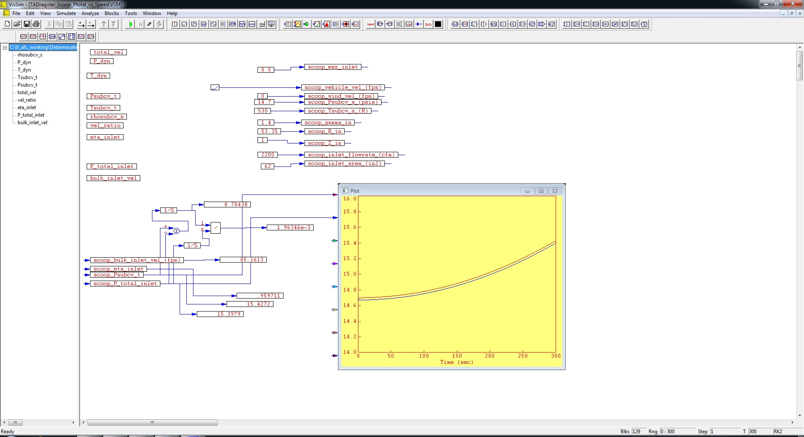

# ========================================
# Determination of NHRA Top Alcohol Dragster Scoop Ptotal vs Speed with VISSIM:
# ========================================

## I. NHRA Top Alcohol Dragster Scoop Total-Pressure vs. Vehicle Speed:

## 
## *Note: Performance Data and Analysis performed using VISSIM, ( https://web.solidthinking.com/vissim-is-now-solidthinking-embed )
